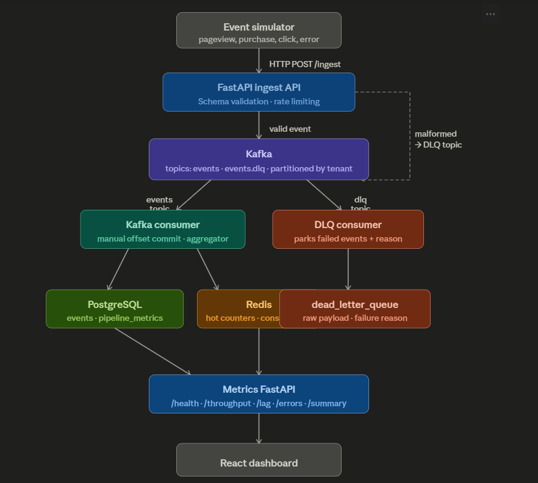

# StreamPulse

I built this to actually understand how a real-time data pipeline fits together end-to-end — not just the theory, but wiring up each piece and seeing where things break. It's not production software, just a project for learning.



---

## What it does

A simulator fires fake e-commerce events — page views, purchases, clicks, errors — at a FastAPI endpoint. The API validates them and pushes them onto Kafka. From there:

- **Main consumer** reads events, writes them to Postgres, updates live counters in Redis, and rolls up 60-second aggregation windows into a `pipeline_metrics` table. Offsets are committed **manually**, only after the row is safely in Postgres.
- **DLQ consumer** catches anything that failed validation and parks it in `dead_letter_queue` with the raw payload and a failure reason.

Every 30 seconds the consumer calculates per-partition lag and pushes it to Redis. A small metrics API reads from both Redis and Postgres and exposes five endpoints. A React dashboard polls those every 10 seconds.

---

## Stack

| Layer | Tech |
|---|---|
| Ingestion API | FastAPI + kafka-python |
| Message bus | Apache Kafka (Confluent) |
| Storage | PostgreSQL 15 |
| Cache / counters | Redis 7 |
| Metrics API | FastAPI |
| Dashboard | React + Vite |

---

## Project layout

```
StreamPulse/
│
├── ingest/
│   ├── main.py          POST /ingest — validation, rate limiting (200 req/min)
│   ├── producer.py      Kafka producer singleton (acks=all, gzip)
│   └── schemas.py       Pydantic event models + validators
│
├── consumer/
│   ├── main.py          Consumer loop, manual offset commits
│   ├── db.py            SQLAlchemy engine + insert helpers
│   ├── cache.py         Redis counters + lag storage
│   ├── aggregator.py    60-second tumbling window → pipeline_metrics
│   ├── lag.py           Per-partition lag calculation every 30s
│   └── dlq_consumer.py  Separate consumer for the dead-letter topic
│
├── metrics/
│   └── main.py          /health  /throughput  /lag  /errors  /summary
│
├── dashboard/
│   ├── vite.config.js   Dev proxy: /api → localhost:8001
│   └── src/
│       ├── App.jsx      Four cards, auto-refresh every 10s
│       └── App.css      Dark theme, no external UI libraries
│
├── simulator/
│   └── generate.py      Sends realistic + intentionally broken events
│
├── db/
│   └── init.sql         Schema: events, dead_letter_queue, pipeline_metrics
│
└── docker-compose.yml   Kafka, Zookeeper, Postgres, Redis
```

---

## Running it

**1. Start the infrastructure**

```bash
docker-compose up -d
```

**2. Install Python dependencies**

```bash
pip install poetry
poetry install
```

**3. Start each service in its own terminal**

```bash
# Terminal 1 — ingest API
uvicorn ingest.main:app --port 8000 --reload

# Terminal 2 — main consumer
python -m consumer.main

# Terminal 3 — DLQ consumer
python -m consumer.dlq_consumer

# Terminal 4 — metrics API
uvicorn metrics.main:app --port 8001 --reload
```

**4. Open the dashboard**

```bash
cd dashboard
npm install
npm run dev
```

→ `http://localhost:3000`

**5. Fire some events**

```bash
# 10 events/sec, 10% intentionally malformed (to fill up the DLQ)
python -m simulator.generate --rate 10 --bad 0.1
```

---

## Ports at a glance

| | |
|---|---|
| Ingest API | `localhost:8000` |
| Metrics API | `localhost:8001` |
| Dashboard | `localhost:3000` |
| Postgres | `localhost:5432` |
| Redis | `localhost:6379` |
| Kafka | `localhost:9092` |

---

## Metrics endpoints

| Endpoint | What it returns |
|---|---|
| `GET /health` | Postgres + Redis connectivity |
| `GET /throughput` | Total events + last 60s window breakdown by type |
| `GET /lag` | Per-partition consumer lag |
| `GET /errors` | DLQ total + top failure reasons |
| `GET /summary` | Everything on one page, including error rate |

---

## A few things I learned

**Manual offset commits** feel unnecessary until you think of "committed = definitely in the database". If the consumer crashes between writing and committing, Kafka redelivers the message. The `ON CONFLICT DO NOTHING` on the `events` table makes that safe.

**Lag lives in Redis, not Kafka.** The metrics API never connects to Kafka. The consumer calculates lag every 30 seconds and stores it in a Redis hash. Simpler than having every reader spin up a Kafka client.

**A daemon thread for the aggregator** is much simpler than squeezing a timer into the poll loop. The thread sleeps 60 seconds, flushes the window, repeats. It dies automatically when the main process exits.

**The DLQ consumer stores raw bytes**, not parsed JSON. Malformed messages might not be valid JSON at all, so decoding happens best-effort and the raw string always gets persisted regardless.
